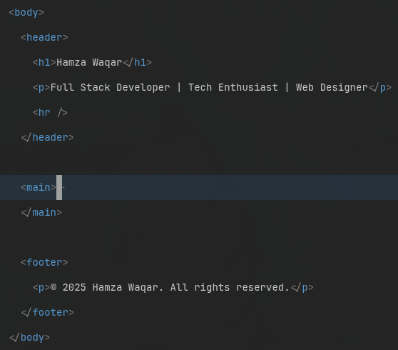
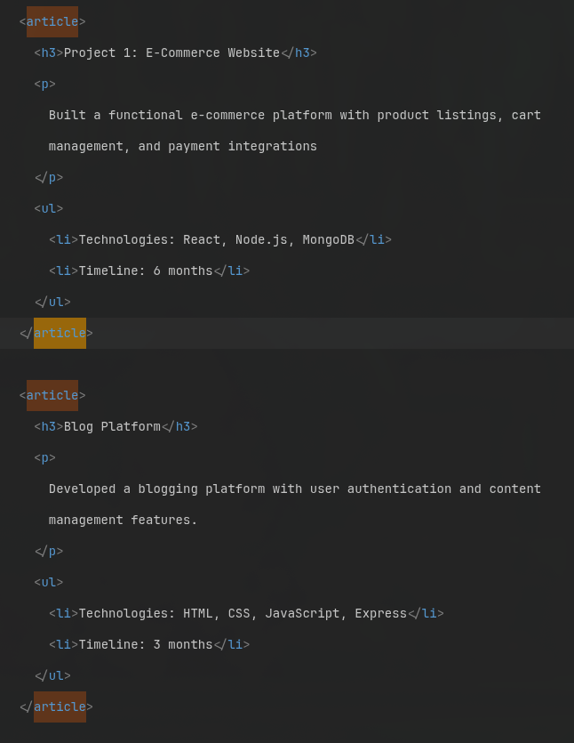
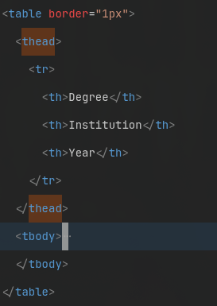
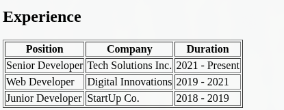

# HTML Resume – Single Page Website

A clean and simple **single-page resume** made using pure HTML.
It focuses on semantics and proper HTML, sections & tables for layout.

This resume website showcases personal info with skills and experience all readable in a single index.html page.

### Included Sections

- Header / Name
- About Me
- Skills List
- Experience (Table)
- Projects
- Education (Table)
- Contact Information
- Footer


## Setup Instructions

**Clone the repository**

```
git clone https://github.com/h-waqar/html-resume.git
```

**Navigate into the project**

```
cd html-resume
```

**Open the file**
Double-click `index.html`, or open it in any browser

- ## Examples of HTML Semantics

  - Use `<header>`, `<main>`, and `<footer>` to separate top content, main resume content, and bottom content.
    

  - Use `<article>` inside **Projects** to group each project separately.
    

  - Use `<thead>`, `<tbody>`, and `<th>` in tables to clearly separate headings and data.
    
    

  - Use `<strong>` for important text and `<em>` for emphasized text (not just bold/italic).

  - Use `<address>` for contact information instead of plain paragraphs.

  - Use `<a href="mailto:...">` and `<a href="tel:...">` for email and phone links.

  - Group related content using `<section>` instead of `<div>` tags.

  - Keep heading order correct (`h1` → `h2` → `h3`)

## Author

**Hamza Waqar**
 Full Stack Developer
 📍 Faisalabad, Pakistan
 📧 hamzawaqar556@gmail.com
